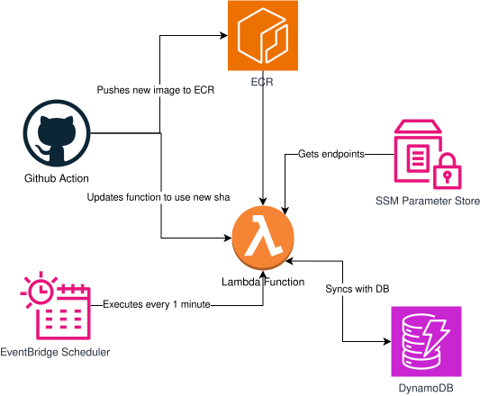

# nyanwatch

## What it does:

1. Gets endpoints to check from SSM Parameter Store
2. Checks for their status
3. Checks according to dynamodb which services just got down since last run, or which are now OK since last run.
4. Notifies with discord DM via [nyanify](https://github.com/b-zago/nyanify)(my webhook for discord DMs) of service status change.

## How it's built

Code that runs on lambda [here](https://github.com/b-zago/nyanwatch)

GitHub workflow that I use to push docker image to ECR and update lambda function [here](https://github.com/b-zago/actions/blob/main/.github/workflows/build-push-ecr-lambda.yaml)

## TODOs

- [ ] Automate updating SSM Parameter
- [ ] Make a fallback nyanify service in case it's dead
